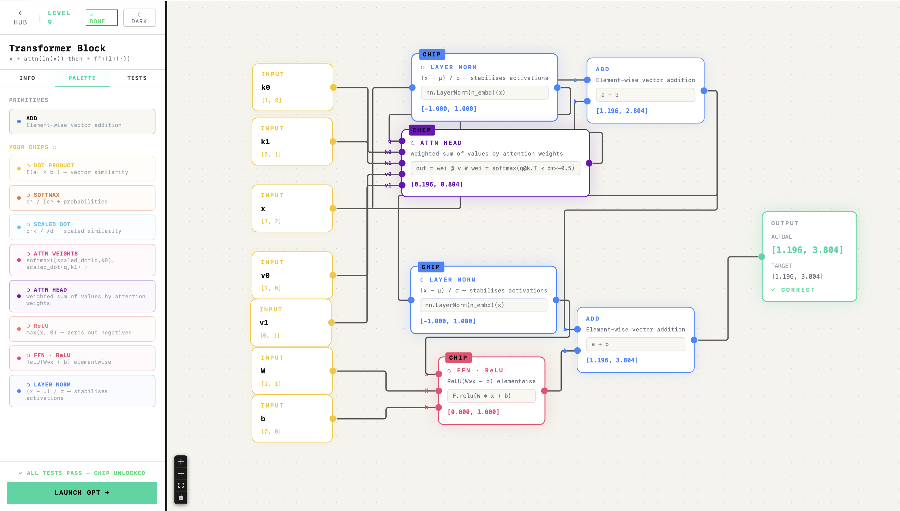
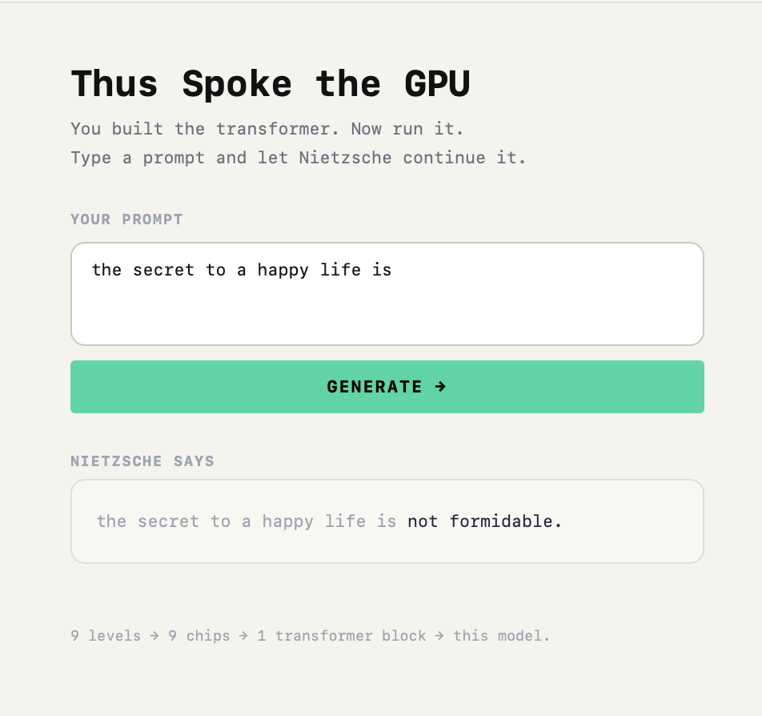

# Thus Spoke the GPU

> *"God is not dead. He simply ran out of compute."*

A Nandgame-style interactive learning experience where you build a GPT transformer from scratch — one chip at a time.



---

## What is this?

Inspired by [Nandgame](https://nandgame.com/), this is a browser-based puzzle game where each level asks you to wire together primitive operations to produce a reusable **chip**. Chips unlock for later levels. By the end you've assembled a full transformer block from dot products, softmax, attention, layer norm, and FFN — and then you run a real character-level GPT trained on Nietzsche's writings.

---

## The 9 Levels

| # | Level | You Build | Key Operation |
|---|-------|-----------|---------------|
| 1 | **Dot Product** | `dot_product` chip | multiply + sum |
| 2 | **Softmax** | `softmax_vec` chip | exp → divide |
| 3 | **Scaled Score** | `scaled_dot` chip | dot / √d |
| 4 | **Attention Weights** | `attn_weights` chip | softmax(scaled scores) |
| 5 | **Attention Head** | `attn_head` chip | weighted sum of values |
| 6 | **ReLU** | `relu` chip | max(x, 0) |
| 7 | **Feed-Forward** | `ffn_relu` chip | ReLU(W⊙x + b) |
| 8 | **Layer Norm** | `layer_norm` chip | (x − μ) / σ |
| 9 | **Transformer Block** | `transformer_block` chip | x + attn(ln(x)) + ffn(ln(·)) |
| 🧠 | **Live GPT** | — | Run the real Nietzsche model |

### What Awaits in the Final Level
After building the architecture, you get to have deeply philosophical (and sometimes highly quirky!) conversations with the custom character-level Nietzsche GPT.



---

## How to Play

1. Read the **INFO** tab — goal, math formula, GPT context
2. Open the **PALETTE** tab — click a block to add it to the canvas
3. Wire inputs to the block and the block to the output
4. The **TESTS** tab auto-evaluates 3 test cases live
5. All 3 pass → chip unlocked → next level opens

---

## Running Locally

```bash
npm install
npm run dev
```

Then open `http://localhost:5173`.

---

## Deploying

### Vercel (recommended)
1. Push to GitHub
2. Import the repo in [vercel.com](https://vercel.com)
3. Build command: `npm run build`, output dir: `dist`
4. Done — `vercel.json` already handles SPA routing

### Railway
1. New project → deploy from GitHub
2. Build: `npm run build`
3. Start: `npx serve dist` (or any static file server)

---

## Setting Up the Live GPT Playground

The playground loads a real character-level GPT from HuggingFace. To use your own trained model:

### 1. Convert to ONNX
```bash
optimum-cli export onnx --model . --task causal-lm ./onnx_export/
```
Then in your HuggingFace repo, upload the file as **`onnx/model.onnx`** (transformers.js requires this exact path).

### 2. Export the vocabulary
```bash
python scripts/export_vocab.py nietzsche_model.pt
# Outputs: vocab.json  — upload to repo root
```

### 3. Open the playground
Complete all 9 levels → Hub → "Thus Spoke the GPU" card → LOAD MODEL

---

## Tech Stack

- **React 19** + **TypeScript**
- **@xyflow/react** (ReactFlow) — node/wire canvas
- **Zustand** — progress & theme state (persisted to localStorage)
- **Framer Motion** — animations
- **@huggingface/transformers** — ONNX model inference in browser
- **Tailwind CSS v4** + CSS custom properties for light/dark mode
- **Vite**

---

## Adding More Levels

Each level is a ~40-line entry in `src/data/levelDefs.ts`:

```typescript
{
  id: 10,
  title: 'Cross-Entropy Loss',
  concept: '-log(p_correct)',
  color: '#ff9f1c',
  producesChip: 'cross_entropy',
  availablePrimitives: ['log', 'index0'],
  testCases: [
    { label: '-log(0.8)', inputs: { probs: [0.8, 0.2], target: [1, 0] }, expected: 0.223 },
    // ...
  ],
  initialNodes: [
    { id: 'probs', type: 'inputNode', position: { x: 60, y: 60 }, data: { label: 'probs', fixedValue: [0.8, 0.2] } },
    { id: 'output', type: 'outputNode', position: { x: 800, y: 200 }, data: { target: 0.223, computedValue: null } },
  ],
  // ...
}
```

Then add the chip to `src/engine/chipDefs.ts` and update `LEVEL_CHIP_MAP` in `src/store/progressStore.ts`.

---

## Project Structure

```
src/
  engine/
    blockDefs.ts      primitive operations (multiply, exp, relu, etc.)
    chipDefs.ts       completed chips with closed-form compute functions
    evaluate.ts       graph evaluation engine
    gptForward.ts     TypeScript GPT forward pass (toy model)
    types.ts          shared types
  data/
    levelDefs.ts      all 9 level definitions, test cases, initial nodes
  components/
    ChipBuilder.tsx   main level UI (sidebar + canvas + tests)
    GPTPlayground.tsx live Nietzsche GPT interface
    NietzscheSprite.tsx pixel-art philosopher animation
    canvas/nodes/     ReactFlow node components
  store/
    progressStore.ts  Zustand: completed levels + unlocked chips
    themeStore.ts     Zustand: light/dark theme
  pages/
    Hub.tsx           level selection
    LevelRouter.tsx   routes /level/:id → ChipBuilder
    FinalUnlock.tsx   Nietzsche celebration animation
scripts/
  export_vocab.py     extract vocab.json from nanoGPT checkpoint
```

---

## Contributing

Ideas for more levels:
- Multi-head attention (combine N attention heads)
- Positional encoding (sine/cosine waves)
- Cross-entropy loss
- Byte-pair encoding tokenizer

Open an issue or PR — the architecture is designed for extension.

---

*Built in the spirit of Nandgame. Thus Spoke the GPU.*
